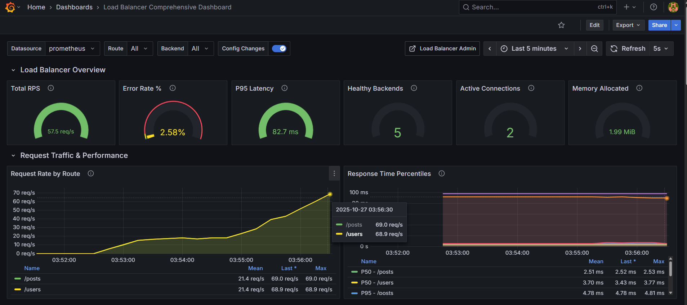
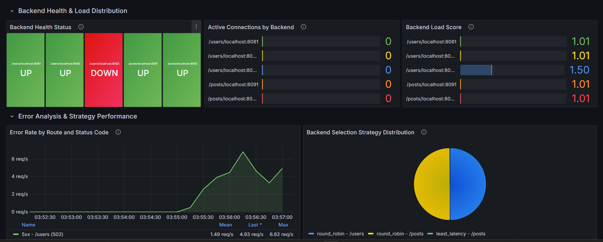
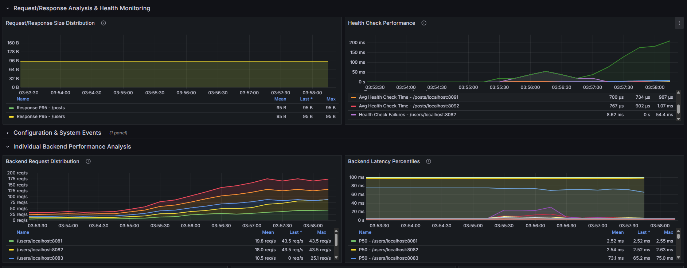
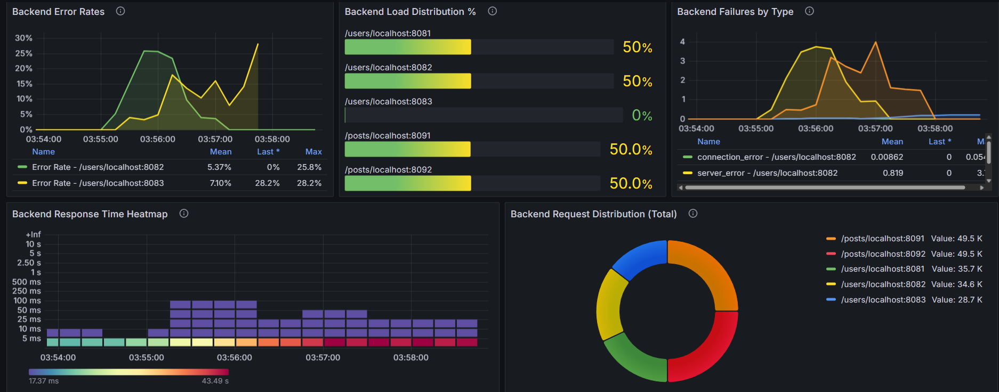

# Load Balancer

A high-performance HTTP load balancer written in Node.js with health checking, multiple load balancing strategies, Prometheus metrics, structured logging, and a runtime admin API.

## Table of Contents

- [Features](#features)
- [Architecture](#architecture)
- [Load Balancing Strategies](#load-balancing-strategies)
- [Resilience](#resilience)
- [Installation](#installation)
- [Quick Start](#quick-start)
- [Configuration](#configuration)
- [Monitoring & Metrics](#monitoring--metrics)
- [Admin API](#admin-api)
- [Running at Scale](#running-at-scale)
- [Testing](#testing)
- [Performance](#performance)
- [Project Structure](#project-structure)
- [Usage Examples](#usage-examples)
- [Design Notes](#design-notes)
- [License](#license)
- [Roadmap](#roadmap)

## Features

### Core Functionality
- Multiple load balancing strategies (Round Robin, Weighted Round Robin, Least Latency, Least Active/Connections, Least Loaded, IP Hash)
- HTTP reverse proxying over a pooled keep-alive agent (powered by `http-proxy`)
- Per-client token-bucket rate limiting with idle-bucket eviction
- Request/response size tracking

### Resilience
- Active health checking with automatic failure/recovery detection
- Per-backend circuit breaker (passive outlier ejection) with half-open recovery
- Automatic failover/retry across backends for idempotent requests
- Upstream timeouts so a hung backend fails over instead of hanging the client
- Graceful shutdown (drains in-flight requests)

### Scale
- Multi-core via Node `cluster` (one worker per CPU, shared listen socket)
- Distributed rate limiting backed by Redis (atomic Lua token bucket) so the
  budget is enforced globally across workers/instances
- Aggregated Prometheus metrics across cluster workers

### Monitoring & Observability
- Prometheus metrics endpoint (`/metrics`)
- Grafana dashboard included as code
- Structured JSON logging with per-request correlation IDs
- Real-time health status and performance metrics (latency, throughput, error rates)

### Management
- HTTP admin API for runtime configuration
- Dynamic route and backend management without a restart

## Architecture

```
┌─────────────┐
│   Clients   │
└──────┬──────┘
       │
       v
┌─────────────────────────────────────┐
│      Load Balancer (Port 8080)      │
│  ┌───────────────────────────────┐  │
│  │   Route Matching (Trie) +     │  │
│  │   Strategy Selection          │  │
│  └───────────┬───────────────────┘  │
│              │                      │
│  ┌───────────v───────────────────┐  │
│  │     Health Check Manager      │  │
│  └───────────┬───────────────────┘  │
│              │                      │
│  ┌───────────v───────────────────┐  │
│  │      Metrics Collection       │  │
│  └───────────────────────────────┘  │
└──────────────────┬──────────────────┘
                   │
        ┌──────────┼───────────┐
        │          │           │
        v          v           v
    ┌────────┐ ┌────────┐ ┌────────┐
    │Backend1│ │Backend2│ │Backend3│
    └────────┘ └────────┘ └────────┘
```

Routes are matched by longest path prefix using a segment Trie. Each matched
route owns a pool of backends and a selection strategy.

## Load Balancing Strategies

Configure a strategy per route via the `strategy` field in `routes.json`
(default: `round_robin`).

### 1. Round Robin — `round_robin`
Distributes requests sequentially across all healthy backends.
**Use case**: Even distribution with similar backend capacity.

### 2. Weighted Round Robin — `weighted_round_robin`
Distributes requests proportionally to each backend's `weight` using a smooth
weighted round robin algorithm. Requires per-backend weights (see Configuration).
**Use case**: Backends with different capacities (CPU, memory).

### 3. Least Latency — `least_latency`
Routes to the healthy backend with the lowest observed average latency.
**Use case**: Mixed workloads with varying response times.

### 4. Least Active / Least Connections — `least_active` (alias: `least_connections`)
Routes to the healthy backend with the fewest in-flight requests.
**Use case**: Long-running requests, streaming.

### 5. Least Loaded — `least_loaded`
Routes to the healthy backend with the lowest combined score of active requests
and normalized latency (`active + avgLatencyMs / 100`).
**Use case**: Mixed workloads where both concurrency and latency matter.

### 6. IP Hash — `ip_hash`
Consistent routing based on the client IP address (FNV-1a hash).
**Use case**: Session affinity, stateful applications.

## Resilience

A single failing backend should never surface as a client-visible error. Two
independent mechanisms detect and route around bad backends:

- **Active health checks** — periodic `GET /health` flips each backend's alive
  flag (proactive: catches a down backend before a user hits it).
- **Circuit breaker** — per-backend `closed → open → half-open` state machine
  driven by *real* request outcomes. After N consecutive failures (or 5xx
  responses) a backend is ejected from selection; after a cooldown it gets trial
  requests and recovers on success (reactive: catches in-band failures fast).

On top of selection:

- **Failover** — a connection-level failure (refused/reset/timeout) on an
  **idempotent** request (GET/HEAD/PUT/DELETE/OPTIONS) is retried on the next
  backend. Non-idempotent requests (POST/PATCH) are not retried, to avoid
  duplicate side effects.
- **Upstream timeout** — `PROXY_TIMEOUT_MS` bounds the wait on a backend so a
  hung upstream fails over instead of hanging the client.
- **Graceful shutdown** — `SIGINT`/`SIGTERM` stop new connections and drain
  in-flight requests before exit.

See [DESIGN.md](DESIGN.md) for the rationale and trade-offs.

## Installation

### Prerequisites
- Node.js 18 or higher
- Prometheus (optional, for metrics)
- Grafana (optional, for visualization)

### Install dependencies

```bash
npm install
```

## Quick Start

```bash
# 1. Start the mock backend servers (ports 8081-8083, 8091-8092)
npm run mock

# 2. In another terminal, start the load balancer (port 8080)
npm start
# ...or run multi-core: one worker per CPU
npm run start:cluster

# 3. Send a request
curl http://localhost:8080/users
```

## Configuration

### Configuration File (`routes.json`)

```json
{
  "routes": [
    {
      "prefix": "/users",
      "backends": [
        "http://localhost:8081",
        "http://localhost:8083"
      ]
    },
    {
      "prefix": "/posts",
      "backends": [
        "http://localhost:8091",
        "http://localhost:8092"
      ],
      "strategy": "least_latency"
    }
  ]
}
```

Each route has:
- `prefix` — the path prefix to match (longest match wins)
- `backends` — list of upstream backends (see below)
- `strategy` — optional; one of `round_robin`, `weighted_round_robin`, `least_latency`, `least_active` (alias `least_connections`), `least_loaded`, `ip_hash` (default `round_robin`)

A backend entry may be a plain URL string, or an object with a `weight`
(used by `weighted_round_robin`; defaults to `1`):

```json
{
  "prefix": "/posts",
  "backends": [
    { "url": "http://localhost:8091", "weight": 3 },
    { "url": "http://localhost:8092", "weight": 1 }
  ],
  "strategy": "weighted_round_robin"
}
```

### Environment Variables
- `PORT` — data-plane (proxy) port (default `8080`)
- `ADMIN_PORT` — control-plane (admin API) port (default `8090`)
- `ADMIN_TOKEN` — if set, admin requests must present it (see Admin API); if unset, the admin API is unauthenticated and logs a warning
- `HEALTH_INTERVAL_MS` — active health-check interval (default `5000`)
- `PROXY_TIMEOUT_MS` — upstream request timeout (default `30000`)
- `LOG_LEVEL` — `silent` | `error` | `info` (default `info`)
- `REDIS_URL` — if set, rate limiting uses Redis (shared across workers); otherwise in-memory
- `WORKERS` — cluster worker count (default: CPU count; only used by `start:cluster`)
- `METRICS_PORT` — aggregated metrics port in cluster mode (default `9100`)

## Monitoring & Metrics

### Prometheus Metrics

The load balancer exposes metrics at `http://localhost:8080/metrics`.

#### Route-Level Metrics
```
lb_route_requests_total{route, method, status_code}
lb_route_request_duration_seconds{route, method}
lb_route_active_requests{route}
lb_route_errors_total{route, error_type}
lb_route_request_size_bytes{route}
lb_route_response_size_bytes{route}
lb_route_strategy_changes_total{route, from_strategy, to_strategy}
```

#### Backend-Level Metrics
```
lb_backend_health_status{route, backend, backend_host}
lb_backend_health_check_duration_seconds{route, backend, backend_host}
lb_backend_health_check_failures_total{route, backend, backend_host}
lb_backend_requests_total{route, backend, backend_host, status_code}
lb_backend_request_duration_seconds{route, backend, backend_host}
lb_backend_active_connections{route, backend, backend_host}
lb_backend_load_score{route, backend, backend_host}
lb_backend_selection_total{route, backend, backend_host, strategy}
lb_backend_failures_total{route, backend, backend_host, failure_type}
```

Node.js process/runtime metrics (`process_*`, `nodejs_*`) are also exposed
automatically.

### Grafana Dashboard

Snapshots of the included dashboard:






Import the included dashboard:

```bash
curl -X POST http://localhost:3000/api/dashboards/db \
  -H "Content-Type: application/json" \
  -d @load-balancer-dashboard.json
```

### Running Prometheus + Grafana

```bash
docker-compose up -d
```

Prometheus is configured (`prometheus.yml`) to scrape the load balancer at
`host.docker.internal:8080/metrics`.

## Admin API

The admin API (control plane) runs on a **separate port** from proxied traffic —
`http://localhost:8090/admin/` by default (`ADMIN_PORT`). When `ADMIN_TOKEN` is
set, every request must present it via `Authorization: Bearer <token>` or the
`X-Admin-Token` header; otherwise the request is rejected with `401`.

```bash
curl -H "X-Admin-Token: $ADMIN_TOKEN" http://localhost:8090/admin/list
```

#### List Routes
```bash
GET /admin/list
```

#### Add Backend to Route
```bash
POST /admin/add-backend
Content-Type: application/json

{ "prefix": "/users", "url": "http://localhost:8084", "strategy": "round_robin" }
```

#### Remove Backend from Route
```bash
POST /admin/remove-backend
Content-Type: application/json

{ "prefix": "/users", "url": "http://localhost:8084" }
```

#### Update Route
```bash
PUT /admin/update
Content-Type: application/json

{
  "prefix": "/users",
  "backends": ["http://localhost:8081", "http://localhost:8082"],
  "strategy": "least_active"
}
```

## Running at Scale

A single Node process uses one core. For multi-core, run the cluster entry — it
forks one worker per CPU behind a shared listen socket, restarts dead workers,
and the primary serves **aggregated** Prometheus metrics (summed across workers)
on `METRICS_PORT`:

```bash
npm run start:cluster          # WORKERS defaults to CPU count
WORKERS=4 npm run start:cluster
```

**The catch — shared state.** Each worker has its own memory, so the in-memory
rate limiter diverges: a client capped at 10 can get `10 × workers` through
because the OS spreads its connections across workers. Demonstrated on a 2-worker
cluster, 30 concurrent requests from one IP (burst = 10):

| Limiter | Allowed | Why |
|---------|--------:|-----|
| in-memory (per worker) | 20 | two independent 10-token buckets |
| Redis (shared) | 10 | one global bucket, atomic Lua refill+consume |

Enable the shared limiter by pointing every instance at one Redis:

```bash
docker-compose up -d redis
REDIS_URL=redis://localhost:6379 npm run start:cluster
```

The token bucket runs as a single atomic Lua script (refill + consume + TTL
eviction) so there's no read-modify-write race between workers. On a Redis error
the limiter **fails open** (allows traffic) — availability over strict
enforcement during a blip; see [DESIGN.md](DESIGN.md) §7 for the trade-offs and
the path to horizontal scale.

## Testing

Tests use Node's built-in test runner (no extra test framework):

```bash
npm test
```

Coverage includes unit tests (Trie longest-prefix matching, all balancing
strategies, weighted distribution, circuit-breaker state transitions, rate-limit
refill/eviction, EWMA latency, and the Redis limiter's shared-budget behaviour
across workers) and integration tests that boot the server on ephemeral ports
and exercise routing, round-robin distribution, failover past a dead backend,
idempotent-vs-non-idempotent retry behaviour, 404 handling, and admin token
auth.

## Performance

Benchmark harness (autocannon) comparing a backend hit directly vs. through the
load balancer, plus a degraded run with one backend killed:

```bash
npm run bench
```

Sample run — Node 22, i5-12500H, 50 connections × 10s, loopback (single Node
process, no clustering):

| Scenario              | req/sec | p50 (ms) | p99 (ms) | failed |
|-----------------------|--------:|---------:|---------:|-------:|
| baseline (direct)     |  12,100 |     2.0  |    10.0  |      0 |
| via load balancer     |   1,475 |    32.0  |    69.0  |      0 |
| 1 of 3 backends down  |   1,430 |    32.0  |    55.0  |      0 |

Takeaways: the keep-alive upstream pool sustains ~1,475 req/sec single-core with
no failed requests, and **failover keeps the failure count at 0 even with a third
of the pool down**. The gap to "direct" reflects that the balancer is itself a
full HTTP server + client per request (and is doing per-request metrics); higher
absolute throughput comes from running an instance per core (see
[DESIGN.md](DESIGN.md) §7). Numbers are loopback, so they measure proxy/CPU
overhead rather than real-network latency.

## Project Structure

```
load-balancer/
├── src/
│   ├── core/
│   │   ├── backend.js          # Backend, BackendPool, selection strategies
│   │   ├── loadbalancer.js     # Core balancer: proxy, failover, health checks
│   │   ├── circuitBreaker.js   # Per-backend circuit breaker
│   │   ├── trie.js             # Path-prefix Trie for route matching
│   │   └── metrics.js          # Prometheus metrics
│   ├── middleware/
│   │   ├── rateLimit.js        # In-memory token-bucket rate limiter
│   │   └── redisRateLimiter.js # Distributed (Redis/Lua) rate limiter
│   ├── controller/
│   │   └── admin.js            # Admin API handlers
│   ├── logger/
│   │   └── logger.js           # Structured JSON logging (level-gated)
│   ├── utils/
│   │   └── utils.js            # HTTP helpers
│   ├── server.js               # Single-process entry (data + control plane)
│   └── cluster.js              # Multi-core entry (forks workers, aggregates metrics)
├── tests/                      # Unit + integration tests (node:test)
├── bench/
│   └── bench.js                # autocannon load benchmark
├── mock_servers/               # Mock backend servers for testing
│   ├── backend_user1.js ... backend_post2.js
│   └── start.js                # Spawns all mock servers
├── routes.json                 # Routes configuration
├── prometheus.yml              # Prometheus config
├── load-balancer-dashboard.json# Grafana dashboard as code
├── docker-compose.yml          # Prometheus + Grafana stack
├── DESIGN.md                   # Architecture & design notes
├── package.json
└── README.md
```

## Usage Examples

```bash
# Admin API is on the control-plane port (8090) and token-gated when ADMIN_TOKEN is set
AUTH="-H X-Admin-Token:$ADMIN_TOKEN"

# Add a backend to an existing route
curl -X POST http://localhost:8090/admin/add-backend $AUTH \
  -H "Content-Type: application/json" \
  -d '{"prefix":"/users","url":"http://localhost:8084","strategy":"round_robin"}'

# Remove a backend from a route
curl -X POST http://localhost:8090/admin/remove-backend $AUTH \
  -H "Content-Type: application/json" \
  -d '{"prefix":"/users","url":"http://localhost:8084"}'

# Update an entire route configuration
curl -X PUT http://localhost:8090/admin/update $AUTH \
  -H "Content-Type: application/json" \
  -d '{"prefix":"/users","backends":["http://localhost:8081","http://localhost:8082"],"strategy":"least_active"}'

# List all routes and their backends
curl $AUTH http://localhost:8090/admin/list

# Send test traffic (data plane, port 8080)
for i in $(seq 1 100); do curl -s http://localhost:8080/users > /dev/null; done
```

## Design Notes

See [DESIGN.md](DESIGN.md) for the architecture, data-structure and algorithm
choices (Trie routing, smooth weighted round robin, EWMA latency), the failure
model (health checks + circuit breaker + failover), the consistency model, and
the horizontal-scaling story.

## License

This project is licensed under the MIT License — see the [LICENSE](LICENSE) file for details.

## Roadmap
- [ ] WebSocket proxying
- [ ] Configuration hot-reload
- [ ] Configuration validation
- [ ] Tail-latency mitigation (power-of-two-choices, hedged requests)
